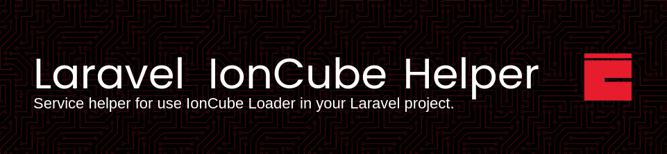

This Composer package simplifies the integration of ionCube encoded files into Laravel projects, providing convenient functions and utilities for managing ionCube-encoded components.

## Installation

You can install the package via Composer:

```bash
composer require murilochianfa/laravel-ioncube-helper
```

Next, publish the configuration file:

```bash
php artisan vendor:publish --provider="MuriloChianfa\LaravelIoncubeHelper\IoncubeHelperServiceProvider"
```

### Dependencies

- *Ioncube Loader 13.0 or higher.*
- *Laravel 10.0 or higher.*
- *PHP 8.2 or higher.*

## Usage

Create a new service **App/Services/LicenseService.php**

```php
<?php

namespace App\Services;

use MuriloChianfa\LaravelIoncubeHelper\LicenseService as License;

final readonly class LicenseService extends License
{
    const LICENSE_PATH = '/path/to/license/license.txt';
}
```

<hr>

You can create functions to get any property from your license.

Adding "Modules" property in license creation by example:

```bash
make_license64... --property "Modules='foo,bar'"
```

```php
<?php

namespace App\Services;

use MuriloChianfa\LaravelIoncubeHelper\LicenseService as License;

final readonly class LicenseService extends License
{
    const LICENSE_PATH = '/path/to/license/license.txt';

    public static function modules(): array
    {
        $modules = self::getProperty('Modules');
        return explode(',', $modules);
    }
}
```

<hr>

> [!IMPORTANT]
>
> Customize the **resources/views/vendor/license.blade.php** file with your project style.

## Commitment to Quality
During package development, try as best as possible to embrace good design and
development practices to try to ensure that this package is as good as it can
be. The checklist for package development includes:

-   ✅ Be fully PSR4 and PSR12 compliant.
-   ✅ Include comprehensive documentation in README.md.
-   ✅ Have no PHPCS warnings throughout all code.

### Testing

``` bash
composer style
```

### Security

If you discover any security related issues, please email murilo.chianfa@outlook.com instead of using the issue tracker.

## Credits

- [Murilo Chianfa](https://github.com/MuriloChianfa)
- [All Contributors](../../contributors)

## License

The MIT License (MIT). Please see [License File](LICENSE.md) for more information.
